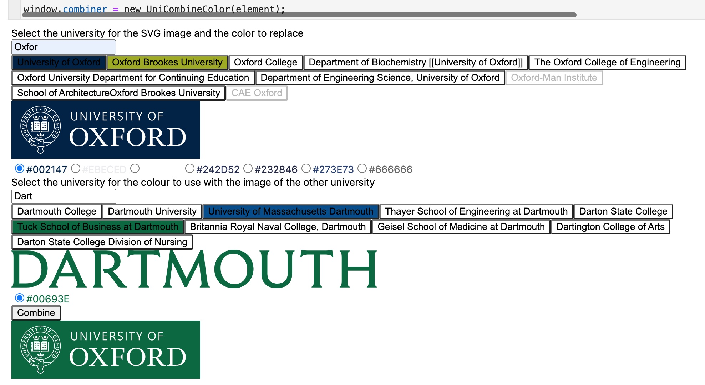

# wiki-university-colours
A project wherein I datamined wikipedia for the university colours and made a JS snippet to combine the colours of one into the other.

The data quality makes it a partial failure. But it works.

`new UniCombineColor(containing_div)` will add the functionality sought to the HTMLElement `containing_div`.
This is a screenshot as JS gets rightfully stripped from markdown in GitHub (else your cookies could be stolen):

